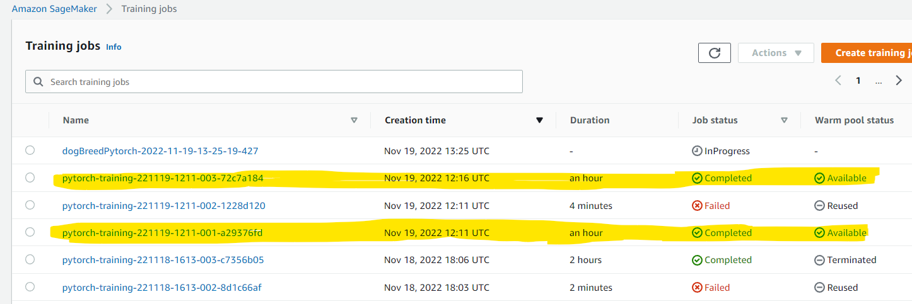
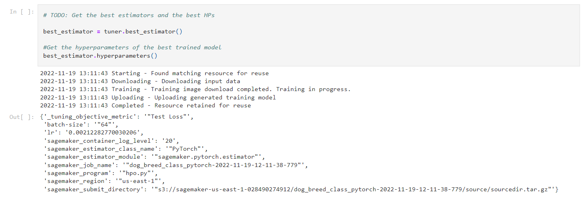
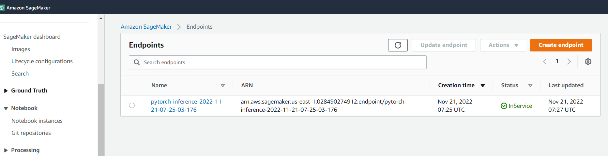

# Image Classification using AWS SageMaker

Use AWS Sagemaker to train a pretrained model that can perform image classification by using the Sagemaker profiling, debugger, hyperparameter tuning and other good ML engineering practices. 

## Project Set Up and Installation
This project is for determine the given dog image breed, the trained data have 133 dog breed which used for our model training, the project done using pytorch library throw sagemaker, and we used the transfer learning throw pretrained model which is resnet50 with modifing the outputs classes number to 133 as we have 133 dog breed classes.
The trained data in this project is more than 8000 dogs images with the different 133 breeds, and also we have validation & test images will be used to detemine the best model.

## Dataset
The trained data in this project is more than 8000 dogs images with the different 133 breeds, and also we have validation & test images will be used to detemine the best model.

### Access
I uploaded the data to an S3 bucket through the AWS Gateway so that SageMaker has access to the data. 

## Hyperparameter Tuning
I used a resnet50 pretrained model with adjusting the output classes to 133, using tranfser learning helps our algorthim learning faster and provide better accuracy.
I did hyperparameter tuning for two parameters which are learning rate & batch size, and I give the following ranges:
  - "learning rate": [0.001, 0.1]
  - "batch size": [64, 128, 256, 512]
  
- Screenshot of the completed training jobs:
  
- The best hyperparameters from all my training jobs:
  

## Debugging and Profiling
First I configured Debugger & Profiler Rules and Hook Parameters, after that I pased these parameters into my estimator to catch any error specified into the defined rules. 

### Results
I get that my model have two problems which are overfitting & bad learning rate hyperparameters.

## Model Deployment
I deployed the model as shown at ipynb file, to get a prediction from this endpoint you have only to send the image location into the predict function, and aftar that using the plot_result function to show the predicted imahe and it's label and the preticted label from the model.

Screenshot of the deployed active endpoint in Sagemaker:
  

